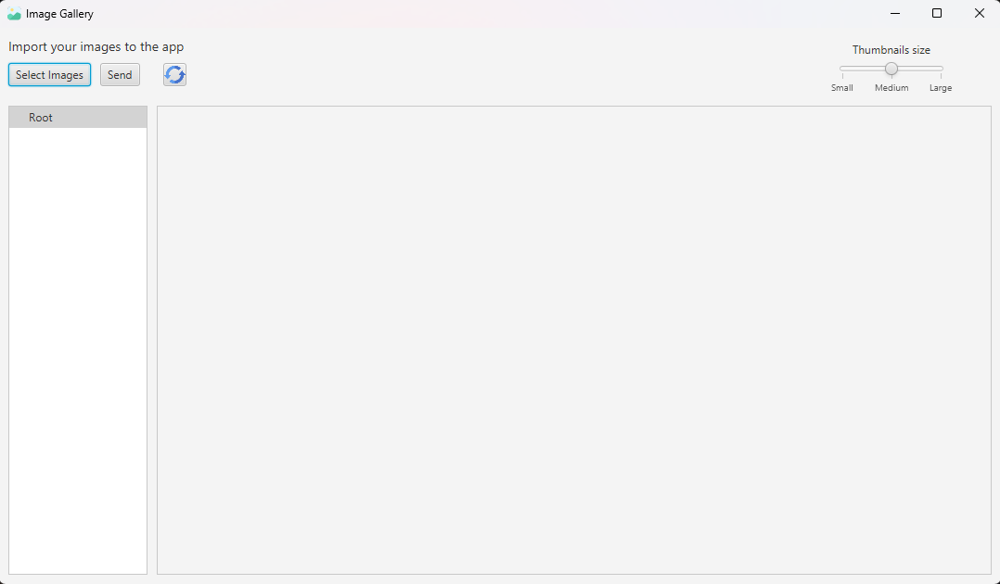
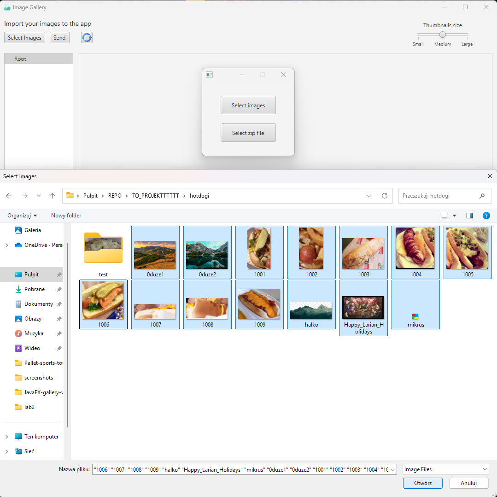
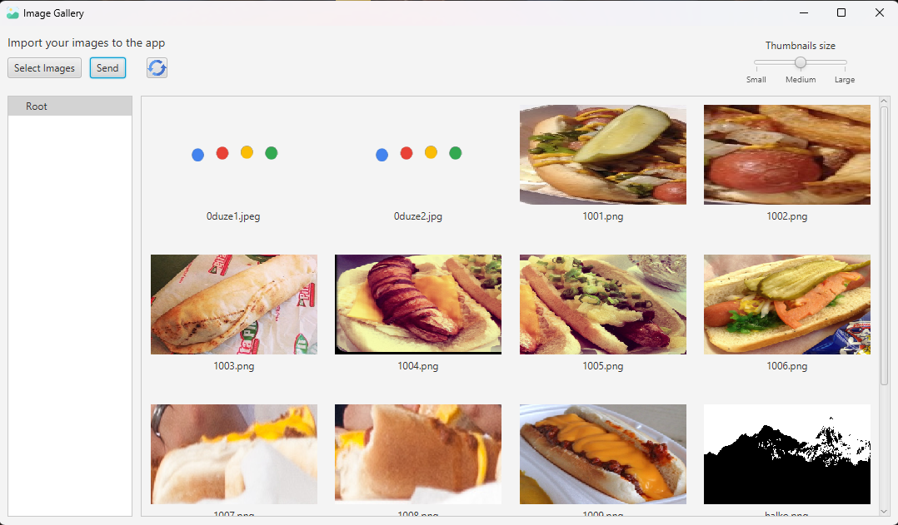
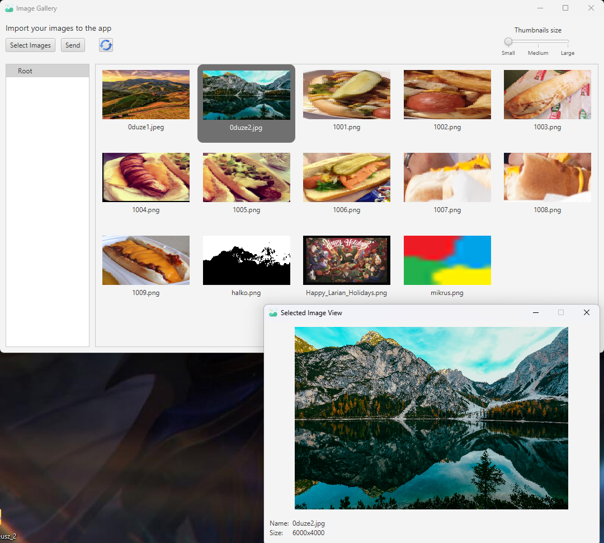

# SpringWebFlux-JavaFx-Thumbnail-Generator

---

## Authors

Project was originally developed on BitBucket by Mateusz Bobula, Konrad Tendaj, and Bartosz Knapik as part of the AGH UST Project 2024/25.

---

## Technologies

### Server (`server/`)
- **Spring Boot** 
- **Reactive REST API (Spring WebFlux)**
- **H2 Database** 
- **Spring Data JPA**
- **Thumbnailator** - for image thumbnail generation

### Client (`client/`)
- **JavaFX**
- **Spring Boot** 
- **Reactive API Client (Spring WebFlux)**

---

## Key features
- **Reactive image gallery system** based on Spring WebFlux
- **Server**:
  - Accepts **single images** or **folders** from the client
  - Processes each image into **three thumbnail sizes**
  - **Streams thumbnails reactively** (smaller images delivered first if processed faster)
- **Client** (JavaFX):
  - Allows users to **load images from their computer**
  - Supports **organizing images into folders**
  - Enables **sending images/folders to the server** for processing
- **Fully asynchronous communication** with **real-time updates**

---

## Basic workflow

1) Select images

2) Choose images or zip file with images

3) Send images to the server and wait for thumbnails

4) U can view thumbnails in different size and click to see the original image

--- 
### Changelog

[Changelog](changelog.md)

---

### Running the Project

[Running Instructions](usage-instructions.md)
